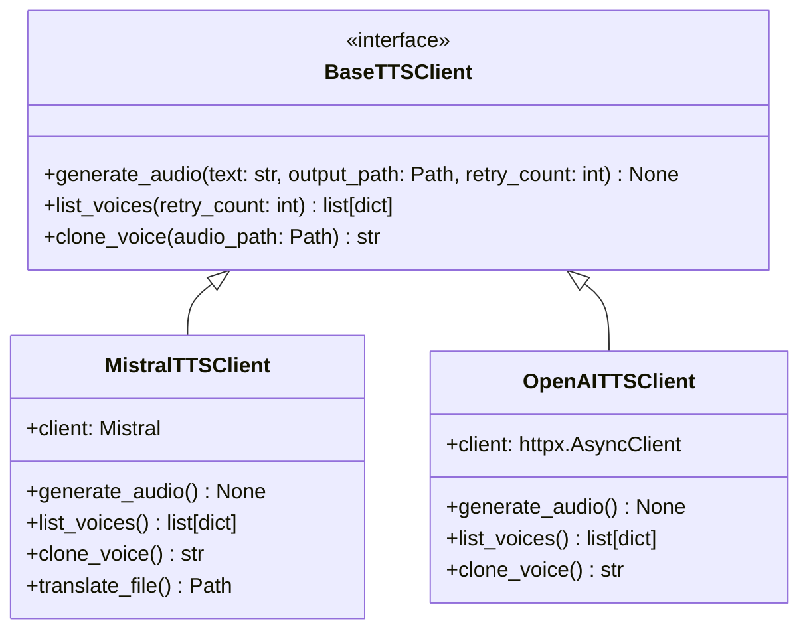

# Design Specification: OpenAI TTS Integration

## Overview
This document outlines the architecture, data flow, and interface modifications required to integrate the OpenAI TTS API alongside the existing Mistral Voxtral TTS engine. This feature enables high-quality text-to-speech synthesis in languages not natively supported by Mistral, such as Polish.

---

## 1. Core Architecture

We adopt a **Unified Provider Interface** (Factory Pattern) to support multiple text-to-speech engines cleanly.



### 1.1 Base Interface (`src/api/base_client.py`)
A new abstract base class defining the contract for all TTS engines:
- `generate_audio(text, output_path, retry_count)`: Generates audio for a chunk and writes it to disk.
- `list_voices(retry_count)`: Lists available preset voices.
- `clone_voice(audio_path)`: Registers reference audio for zero-shot cloning.

### 1.2 Mistral Client (`src/api/mistral_client.py`)
Refactored to implement `BaseTTSClient`. Keeps the current Voxtral API integration and translation capabilities.

### 1.3 OpenAI Client (`src/api/openai_client.py`)
Implements `BaseTTSClient`.
- Targets the OpenAI Audio Speech API: `https://api.openai.com/v1/audio/speech`.
- Uses asynchronous HTTP requests (via `httpx` or `aiohttp`) or the `openai` SDK.
- Supports the `tts-1` model (and optionally `tts-1-hd` via configuration).
- Exposes standard OpenAI voices: `alloy`, `echo`, `fable`, `onyx`, `nova`, `shimmer`.
- Raises `NotImplementedError` if `clone_voice` is called.

### 1.4 Client Factory (`src/api/factory.py`)
A unified entry point to retrieve a client instance:
```python
def get_tts_client(engine: str, api_key: str) -> BaseTTSClient:
    if engine == "openai":
        return OpenAITTSClient(api_key=api_key)
    return MistralTTSClient(api_key=api_key)
```

---

## 2. CLI Updates (`src/cli.py`)
- **Parameters:**
  - `--engine`: Choice of `mistral` or `openai` (default: `mistral`).
  - `--openai-key`: API key for OpenAI (overrides `OPENAI_API_KEY` env var).
- **Validation:**
  - If `--engine openai` is selected, an OpenAI API key must be provided (via `--openai-key`, `--api-key`, or `OPENAI_API_KEY` in `.env`).
  - If `--engine openai` is selected and `--voice` (cloning) is provided, a validation error is raised immediately.

---

## 3. TUI Updates (`src/tui.py`)
- **Widgets:**
  - An **Engine** dropdown select (`Mistral` or `OpenAI`).
  - An **OpenAI API Key** input field (masked).
- **Interactive Logic:**
  - Changing the selected engine dynamically repopulates the **Default Voice** selection menu:
    - **Mistral:** `en_paul_neutral`, `en_sarah_expressive`.
    - **OpenAI:** `alloy`, `echo`, `fable`, `onyx`, `nova`, `shimmer`.
  - In OpenAI mode, attempts to select a voice cloning path or manually override the voice ID with an external path will be blocked with a validation warning.

---

## 4. WebUI Updates

### 4.1 Web Backend (`src/web.py`)
- **API Endpoint (`/api/generate`):**
  - Accepts `engine` and `openai_key` parameters.
  - Resolves the API key based on the selected engine.
  - **Strict Validation:** Returns `HTTP 400 Bad Request` if `engine == "openai"` and a `voice_file` (for cloning) is uploaded.
- **Pipeline Runner (`run_generation_pipeline`):**
  - Resolves the correct client from `get_tts_client(engine, api_key)` and runs the chunk-by-chunk generation.

### 4.2 Web Frontend (`src/web/static/`):
- **Layout (`index.html`):**
  - Adds an **Engine** selector dropdown.
  - Adds an **OpenAI API Key** field, toggled based on selected engine.
- **Logic (`app.js`):**
  - Dynamically switches the voice presets dropdown list.
  - Handles client-side validation to prevent voice cloning file uploads when OpenAI is active.
  - Packs `engine` and `openai_key` into the upload payload.
