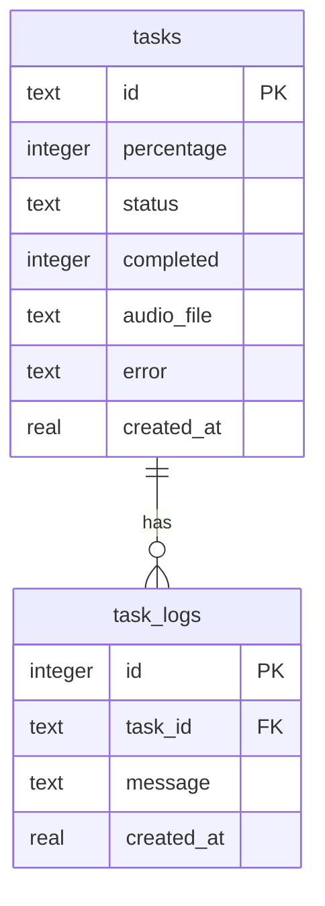

# Design Specification: Robust Task State Management

## Overview
This document outlines the architecture, database schema, API integration, and background cleanup processes required to transition task state tracking and logging from in-memory structures to a persistent SQLite database. This ensures task histories and logs survive server restarts and memory leaks are prevented via automated background purging.

---

## 1. Database Schema (`storage/state.db`)

We define two tables in a SQLite database with foreign key cascades and indexes.

### 1.1 `tasks` Table
- `id` (TEXT PRIMARY KEY): UUID of the task.
- `percentage` (INTEGER): Progress integer between `0` and `100`.
- `status` (TEXT): Text state (`Pending`, `Translating`, `Generating Audio`, `Completed`, `Failed`, etc.).
- `completed` (INTEGER): Boolean flag (`1` for completed, `0` otherwise).
- `audio_file` (TEXT): Name of the generated file (nullable).
- `error` (TEXT): Error details if failed (nullable).
- `created_at` (REAL): Unix timestamp when the task was created.

### 1.2 `task_logs` Table
- `id` (INTEGER PRIMARY KEY AUTOINCREMENT): Auto-incremented row ID.
- `task_id` (TEXT): Foreign key referencing `tasks(id)` with `ON DELETE CASCADE`.
- `message` (TEXT): The logged message line.
- `created_at` (REAL): Unix timestamp when the log was written.

*Index:* An index on `task_logs(task_id)` is created to optimize indexed lookups of logs.

---

## 2. Component Design

### 2.1 Database Helper (`src/core/task_db.py`)
A `TaskDatabase` helper class wraps connection management and operations:
- Initialized on application startup.
- Enables foreign keys (`PRAGMA foreign_keys = ON;`).
- Connection parameters: `timeout=30.0` to permit concurrent write operations to queue up.
- Exposes clean methods:
  - `create_task(task_id: str) -> None`
  - `update_task(task_id: str, percentage: int = None, status: str = None, completed: bool = None, audio_file: str = None, error: str = None) -> None`
  - `add_log(task_id: str, message: str) -> None`
  - `get_task(task_id: str) -> dict`
  - `get_logs(task_id: str, after_id: int = 0) -> list[dict]`
  - `delete_old_tasks(cutoff_time: float) -> int`

### 2.2 Logging Handler (`src/web.py`)
`TaskLogHandler` intercepts log calls and writes them to SQLite using `TaskDatabase.add_log(task_id, message)`.

### 2.3 Background Purger Task (`src/web.py`)
An asynchronous cleanup loop running on the FastAPI event loop:
- Fires every 30 minutes.
- Purges all tasks and cascaded logs older than 24 hours.

---

## 3. SSE Stream Optimization (`/api/progress`)
- The client passes a parameter tracking the last log ID it successfully rendered.
- The SSE endpoint only queries and streams new logs (`id > last_log_id`), reducing data size and query overhead.
