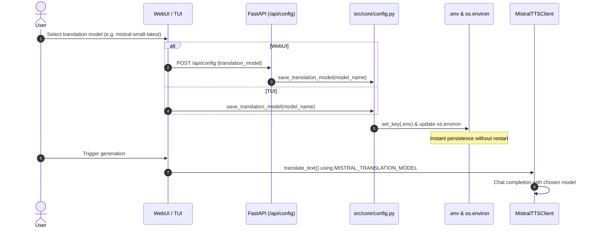

# ADR: Configurable Mistral Translation Model Selection

## Status
Accepted

## Context
Previously, the translation subsystem used a hardcoded model identifier: `mistral-large-latest`. While `mistral-large-latest` offers high translation quality, it presents critical limitations for general users:
1. **Tier Restrictions (HTTP 403 `tier_not_allowed`):** Free-tier and entry-tier Mistral AI accounts lack access to the flagship `mistral-large` family, completely breaking the translation pipeline.
2. **Cost and Latency:** Large models incur higher API latency and token pricing, which is often unnecessary for straightforward narrative or subtitle translations.
3. **Rigid Configuration:** Users had no mechanism to choose smaller, faster, or cheaper models (e.g., `ministral-8b-latest`, `mistral-small-latest`) without editing source code.

## Decision

We introduce a configurable translation model setting with dynamic switching and persistent storage:
1. **Default Model (`ministral-8b-latest`):** Set as the project-wide default. It is available across all API tiers (including free/trial plans), offers high throughput, and lowers processing costs.
2. **Environment Configuration (`MISTRAL_TRANSLATION_MODEL`):** The primary source of truth, loaded via `.env` or system environment variables.
3. **Dynamic Persistence:**
   - Changes made in the **WebUI** or **TUI** invoke `save_translation_model()` in [config.py](file:///home/fox/repos/mistral-tts/src/core/config.py).
   - Writes directly to `.env` using `python-dotenv`'s `set_key()`, preserving existing comments and environment keys.
   - Synchronizes `os.environ["MISTRAL_TRANSLATION_MODEL"]` immediately, eliminating the need to restart the WebUI backend process.
4. **Cache Partitioning:**
   - The active translation model name is incorporated into the SHA-256 cache key in [web.py](file:///home/fox/repos/mistral-tts/src/web.py#L106-L135).
   - Prevents cache collisions when switching between different models for the same source text.

## Supported Models

| Model ID | Display Name | Recommended Tier | Characteristics |
| --- | --- | --- | --- |
| `ministral-8b-latest` | Ministral 8B | Free, Starter, Enterprise | **Default.** Edge-optimized, high throughput, zero tier-restriction errors. |
| `ministral-3b-latest` | Ministral 3B | Free, Starter, Enterprise | Ultra-lightweight model with lowest latency and token consumption. |
| `mistral-small-latest` | Mistral Small | Starter, Enterprise | Balanced cost-to-performance for nuanced text translation. |
| `mistral-medium-latest` | Mistral Medium | Enterprise | High-fidelity translation for complex literary styles. |
| `mistral-large-latest` | Mistral Large | Enterprise (Tier 2+) | Flagship model for maximum translation precision; requires elevated account tier. |

## Data Flow & Architecture

### 1. Configuration Core ([config.py](file:///home/fox/repos/mistral-tts/src/core/config.py))
- [`get_translation_model()`](file:///home/fox/repos/mistral-tts/src/core/config.py#L18-L27): Discovers `.env`, loads environment, and returns `MISTRAL_TRANSLATION_MODEL` or falls back to `DEFAULT_TRANSLATION_MODEL` (`ministral-8b-latest`).
- [`save_translation_model(model_name)`](file:///home/fox/repos/mistral-tts/src/core/config.py#L29-L49): Validates non-empty string, locates/creates `.env`, calls `set_key()`, and updates `os.environ`.

### 2. Web API Endpoints ([web.py](file:///home/fox/repos/mistral-tts/src/web.py))
- `GET /api/config`: Returns `{"translation_model": "<model_id>"}` for frontend hydration.
- `POST /api/config`: Accepts JSON or form data, validates model name, updates `.env` and `os.environ`, returning updated config.
- `POST /api/generate`: Receives optional `translation_model` parameter and passes it to the background pipeline runner.

### 3. Frontend & TUI
- **WebUI ([app.js](file:///home/fox/repos/mistral-tts/src/web/static/app.js) & [index.html](file:///home/fox/repos/mistral-tts/src/web/static/index.html)):**
  - Dropdown populated with supported Mistral models under Translation Settings.
  - Automatically fetches initial selection on startup via `GET /api/config`.
  - Dispatches `POST /api/config` on change event for instant persistence.
- **TUI ([tui.py](file:///home/fox/repos/mistral-tts/src/tui.py)):**
  - Textual `Select` widget for translation model.
  - On change, calls `save_translation_model()` and logs confirmation to the TUI console.

### 4. Client Layer ([mistral_client.py](file:///home/fox/repos/mistral-tts/src/api/mistral_client.py))
- [`MistralTTSClient`](file:///home/fox/repos/mistral-tts/src/api/mistral_client.py#L17-L35) accepts an optional `translation_model` parameter. If omitted, falls back to `os.getenv("MISTRAL_TRANSLATION_MODEL", "ministral-8b-latest")`.
- Chat completions in [`translate_text()`](file:///home/fox/repos/mistral-tts/src/api/mistral_client.py#L179-L215) use `model=self.translation_model`.

## Consequences

- **Positive:**
  - Prevents fatal HTTP 403 errors on free-tier and starter accounts out of the box.
  - Changes take effect immediately without requiring service or container restart.
  - Cache entries are isolated by model ID, preventing incorrect cache hits across different translation models.
- **Negative:**
  - Users selecting `mistral-large-latest` on free-tier accounts will still encounter HTTP 403 errors if their account lacks authorization.
