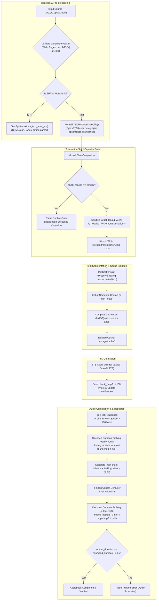
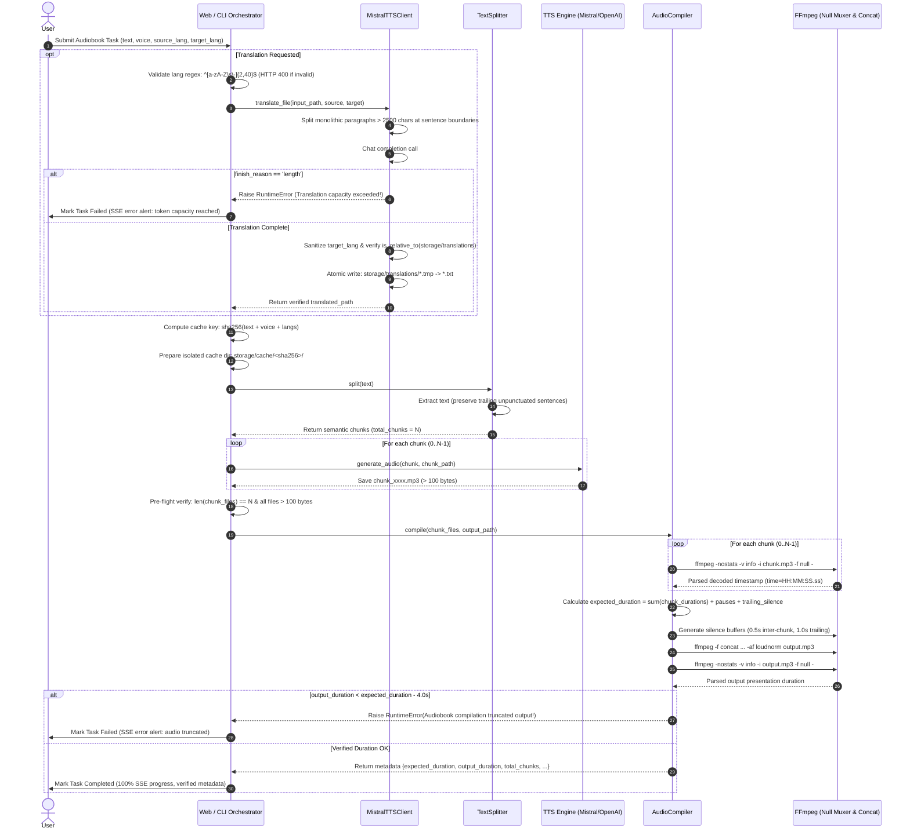

# ADR: Audio Truncation Safeguard & Security Hardening Subsystem
(System Zabezpieczeń Przed Utratą Audio i Utwardzania Bezpieczeństwa)

## Status
Accepted

---

## 1. Context & Problem Statement (Kontekst i problem)

In long-form audiobook generation pipelines, end-to-end audio integrity and system robustness are paramount. Users reported intermittent issues where the final 30 seconds to over 1 minute of synthesized audiobooks were truncated, cut off mid-sentence, or omitted entirely. Additionally, rigorous security and pipeline audits identified edge cases in translation handling, path traversal risks via user-controlled language inputs, and cross-book cache contamination in automated CLI pipelines.

A thorough technical root-cause investigation revealed multiple compounding factors across different stages of the ingestion, translation, splitting, caching, and compilation pipeline:

### 1.1 Root Cause Analysis

1. **FFmpeg `loudnorm` Filter Lookahead Buffer Flush at Stream EOF:**
   - The final audio mastering step passes concatenated chunk MP3 streams through FFmpeg's EBU R128 loudness normalization filter (`-af loudnorm`).
   - `loudnorm` operates with an internal lookahead buffer (~1.5s to 3s). When the input stream abruptly terminates without trailing silence or proper end padding, FFmpeg flushes or drops trailing audio packets, slicing off the narrator's closing sentences.

2. **Translation API Silent Token Exhaustion (`finish_reason == "length"`):**
   - Source texts or ebook chapters often contain massive monolithic paragraphs exceeding 3,000–5,000 characters.
   - When submitted to Mistral chat completion endpoints (`ministral-8b-latest`, `mistral-large-latest`, etc.), the model generated responses that hit `max_tokens` limits. Mistral returned `finish_reason: "length"`, truncating the translation mid-paragraph without raising an API error.
   - Forwarding truncated translated text downstream to TTS resulted in entire story endings being silently dropped.

3. **SRT Parsing & Trailing Cue Edge Cases:**
   - In subtitle extraction (`.srt`), malformed blocks, variable newline delimiters (`\r\n` vs `\n`), BOM markers (`\ufeff`), or cue blocks lacking standard timing markers caused the parser to discard trailing subtitle entries.

4. **Text Splitter Trailing Unpunctuated Text Drop:**
   - Text segmentation split sentences using punctuation lookaheads (`(?<=[.!?])\s+`). When texts lacked trailing terminal punctuation on the final sentence, incomplete chunk accumulation logic could discard or omit the final segment.

5. **Inaccurate Duration Probing via `ffprobe format=duration` (~13% VBR Drift):**
   - `AudioCompiler` initially relied on container-level metadata probing via `ffprobe -show_entries format=duration`.
   - Streaming TTS APIs (Mistral Voxtral, OpenAI TTS) produce raw, headerless Variable Bitrate (VBR) MP3 frames lacking Xing/Info/LAME header tables.
   - Container-level metadata probing estimates duration by dividing raw stream file size by the initial frame's bitrate (or an estimated average). On raw VBR MP3 chunks, this resulted in an inaccurate measurement drift of approximately ~13% compared to actual audio presentation time, causing duration verification to produce false alarms or miss genuine truncations.

6. **Language Parameter Path Traversal Vulnerabilities:**
   - User-supplied translation target languages were concatenated directly into output file paths in `storage/translations/`.
   - Malicious or malformed inputs such as `target_lang = "../../etc"` or custom filenames could break out of the intended directory boundary without strict sanitization and path containment checks.

7. **Cross-Book Cache Contamination and Directory Nesting in CLI:**
   - Early CLI cache management lacked content-addressed hashing across runs, risking cached chunk reuse across different books with identical chunk counts or indices.
   - Sequential CLI invocations using the same class instance mutated `cache_dir`, causing successive cache subdirectories to nest hierarchically (`storage/cache/<hash1>/<hash2>/...`).

8. **Shared Task Temp Collisions & Non-Atomic Translation Writes:**
   - Simultaneous tasks uploading files with generic names (`input.txt`) risked filename collisions.
   - Translated files written directly to target paths risked partial reads if downstream processing began before disk flushing finished.

---

## 2. Decision & Architecture (Decyzja architektoniczna)

We implement a multi-layered **Audio Truncation Safeguard & Security Hardening** subsystem across four core modules: `AudioCompiler`, `MistralTTSClient`, `TextSplitter`, and the orchestration layer (`web.py` / `cli.py`).

The architecture guarantees:
1. **Decoded Presentation Duration Verification:** Replaces container-level header duration probing with FFmpeg null decoding (`-f null -`) to measure true decoded packet audio presentation duration down to the millisecond, eliminating ~13% drift on headerless VBR MP3 chunks.
2. **Translation Strict Capacity Guard:** Raises a fatal `RuntimeError` immediately upon detecting `finish_reason == "length"` in single-chunk and batch translation modes to prevent truncated text from propagating to TTS.
3. **Language Parameter Sanitization & Path Confinement:** Enforces strict regex whitelisting (`^[a-zA-Z\s\-]{2,40}$`) at the Web API boundary and filename sanitization (`re.sub(...)` + `Path.is_relative_to()`) to eliminate path traversal vulnerabilities in `storage/translations/`.
4. **CLI Cache Isolation & Nesting Prevention:** Calculates content-hash directory keys (`storage/cache/<sha256>/`) to prevent cross-book cache contamination and guards property mutation to prevent nested cache directories on sequential CLI runs.



---

## 3. Detailed Component Safeguards

### 3.1 `AudioCompiler` ([audio_compiler.py](file:///home/fox/repos/mistral-tts/src/core/audio_compiler.py))

1. **Trailing Silence End Padding (`trailing_silence_s`):**
   - Configurable constructor parameter with default `trailing_silence_s = 1.0` (second).
   - Dynamically probes the sample rate and audio channel layout of the first chunk (e.g., 22050 Hz mono) using `ffprobe`.
   - Generates an exact matching `trailing_silence.mp3` file via `lavfi` (`anullsrc`) and appends it to the FFmpeg concat demuxer manifest.
   - **Effect:** Provides an acoustic safety cushion for the EBU R128 `loudnorm` lookahead window, guaranteeing 100% of spoken content finishes before the stream closes.

2. **Pre-Flight Chunk Validation:**
   - Before launching FFmpeg, verifies every chunk file exists on disk and has `st_size > 100` bytes.
   - Throws immediate descriptive `FileNotFoundError` or `RuntimeError` if any chunk is missing or empty.

3. **Decoded Presentation Duration Verification (`_probe_duration`):**
   - Probes the exact audio playback duration by decoding the file against FFmpeg's null muxer sink:
     ```bash
     ffmpeg -nostats -v info -i <file_path> -f null -
     ```
   - Regular expression parsing extracts the final decoded timestamp from stderr:
     `matches = re.findall(r"time=(\d+):(\d+):(\d+\.\d+)", result.stderr)`
   - **Technical Rationale: Why `ffprobe format=duration` was inaccurate:**
     - Container-level metadata probing (`ffprobe -show_entries format=duration`) relies on container header metadata or estimates duration by dividing total stream file size by the initial packet's bitrate or an estimated container average.
     - Streaming TTS endpoints (Mistral Voxtral and OpenAI TTS) deliver raw, headerless Variable Bitrate (VBR) MP3 streams without Xing/Info or LAME metadata tags.
     - Because speech bitrate swings dynamically based on narrator silence, vocal pitch, and phoneme complexity, container-level estimation suffers from severe measurement drift (~13% drift compared to true presentation duration).
     - Full decoding through the `-f null -` sink unpacks every MPEG audio frame, calculating duration from actual decoded packet presentation timestamps down to the millisecond.

4. **Probe-Based Expected Duration Calculation & Strict Verification:**
   - Decodes and sums every single audio chunk:
     $$\text{expected\_duration} = \sum_{i=1}^{N} \text{decoded\_duration}(\text{chunk}_i) + (N - 1) \times \text{pause\_duration\_s} + \text{trailing\_silence\_s}$$
   - Measures compiled output presentation duration via the same null decoding command.
   - Enforces a strict duration tolerance check of `4.0s` (accounting for frame alignment padding and encoder metadata overhead):
     ```python
     if output_duration < (expected_duration - tolerance):
         raise RuntimeError(
             f"Audiobook compilation truncated output: expected at least {expected_duration - tolerance:.2f}s "
             f"(expected ~{expected_duration:.2f}s across {len(chunk_paths)} chunks), "
             f"but final file is only {output_duration:.2f}s. "
             f"Audio was truncated by {expected_duration - output_duration:.2f}s!"
         )
     ```
   - Returns structured metadata dictionary:
     `{"expected_duration": float, "output_duration": float, "total_chunks": int, "total_chunks_duration": float, "output_path": Path}`.

---

### 3.2 `MistralTTSClient` ([mistral_client.py](file:///home/fox/repos/mistral-tts/src/api/mistral_client.py))

1. **Sentence-Aware Paragraph Segmentation for Translation:**
   - Plain text translation splits incoming text on double newlines (`\n\n`).
   - Any paragraph exceeding 2,500 characters is segmented at sentence boundaries (`re.split(r'(?<=[.!?])\s+', p)`).
   - If an individual sentence exceeds 2,500 characters, it falls back to word-boundary chunking.
   - Chunks are assembled within a 2,500-character ceiling to comfortably fit within model context windows and output token bounds.

2. **Translation Strict Capacity Guard (`finish_reason == "length"`):**
   - In both [`translate_text()`](file:///home/fox/repos/mistral-tts/src/api/mistral_client.py#L186-L236) and batch SRT JSON translation (`translate_file()`), checks the completion choice status:
     ```python
     finish_reason = getattr(choice, "finish_reason", None)
     if finish_reason == "length":
         logger.error("Mistral translation exceeded token output capacity (finish_reason='length').")
         raise RuntimeError("Mistral translation exceeded token output capacity (finish_reason='length').")
     ```
   - **Effect:** Immediately halts the pipeline with an explicit exception rather than silently passing truncated partial text to subsequent TTS generation.

3. **Language Parameter Sanitization & Path Confinement:**
   - Sanitizes `target_lang` inputs using regex character replacement:
     `sanitized_target_lang = re.sub(r"[^a-zA-Z0-9_-]", "_", target_lang.lower())`
   - Explicitly confines translated output paths to `storage/translations/` using `is_relative_to()`:
     ```python
     output_path = translations_dir / output_filename
     if not output_path.resolve().is_relative_to(translations_dir.resolve()):
         raise ValueError(f"Path traversal detected: {output_filename}")
     ```
   - Prevents directory traversal attacks via relative path segments (e.g. `../../evil`) or absolute destination paths.

4. **Atomic File Replacement & Input Stem Preservation:**
   - Writes translated content to a temporary sibling file (`{output_path}.tmp`).
   - Executes atomic filesystem replacement via `temp_output_path.replace(output_path)` inside a try/finally block ensuring temporary file cleanup.
   - Preserves source file stem when naming translated files:
     `{input_path.stem}_translated_{sanitized_target_lang}{output_suffix}`.

---

### 3.3 `TextSplitter` ([text_splitter.py](file:///home/fox/repos/mistral-tts/src/core/text_splitter.py))

1. **Robust SRT Ingestion:**
   - Strips UTF-8 BOM (`\ufeff`) and normalizes line endings (`\r\n` $\to$ `\n`).
   - Identifies timing lines containing `-->`, extracting all subsequent subtitle text cues per block regardless of cue formatting or line breaks.
   - Handles fallback blocks lacking `-->` by retaining non-numeric content lines.

2. **Preservation of Trailing Unpunctuated Text:**
   - Normalizes whitespace across the corpus while preserving raw wording.
   - Appends any accumulated `current_chunk` buffer upon reaching EOF, ensuring trailing sentences lacking periods, question marks, or exclamation points are never dropped.

---

### 3.4 Orchestration Layer ([web.py](file:///home/fox/repos/mistral-tts/src/web.py) & [cli.py](file:///home/fox/repos/mistral-tts/src/cli.py))

1. **Web API Language Parameter Regex Whitelisting (`web.py`):**
   - Validates incoming `source_lang` and `target_lang` form parameters using a strict regular expression:
     `LANG_REGEX = re.compile(r"^[a-zA-Z\s\-]{2,40}$")`
   - Rejects non-compliant inputs immediately with HTTP 400 Bad Request, stopping path traversal payloads at the API entry point before any filesystem access occurs.

2. **CLI Content-Hash Cache Isolation (`cli.py`):**
   - Generates an isolated cache directory based on SHA-256 hash of the complete job parameters:
     ```python
     cache_key = hashlib.sha256(
         f"{text}{voice_str}{source_lang or ''}{target_lang or ''}".encode("utf-8")
     ).hexdigest()
     self.cache_dir = self.base_cache_dir / cache_key
     ```
   - Audio chunks and manifests are stored under `storage/cache/<sha256>/`.
   - Guarantees complete isolation between different books or voice configurations, preventing cross-book cache contamination.
   - Maintains a local `manifest.json` mapping chunk text to generated audio files; detects mismatches if chunk texts change and forces re-synthesis.

3. **CLI Cache Directory Nesting Prevention (`cli.py`):**
   - Guards against cache directory nesting on sequential `.run()` calls on the same `BooksmithCLI` instance using a property setter pattern:
     ```python
     @property
     def cache_dir(self) -> Path:
         return self._cache_dir

     @cache_dir.setter
     def cache_dir(self, value: Path):
         self._cache_dir = value
         if value.parent != self.base_cache_dir:
             self.base_cache_dir = value
     ```
   - Preserves `base_cache_dir` at `storage/cache` when `value.parent == self.base_cache_dir`, preventing nested directory paths like `storage/cache/<hash1>/<hash2>/...`.

4. **Pre-Compilation Audio Verification & Structured Logging:**
   - Validates that `len(chunk_files) == total_chunks` and every file exists with size $> 100$ bytes before calling `AudioCompiler.compile()`.
   - Logs verified compilation duration against expected chunk duration, giving operators immediate visibility in both CLI progress bars and WebUI SSE console output.

---

## 4. Sequence Diagram: Protected Audio Generation Pipeline



---

## 5. Verification & Test Coverage (Weryfikacja i testy)

The entire safeguard and security subsystem is covered by automated unit and integration tests across the test suite:

| Test File | Test Case | Safeguard / Security Check Verified |
| --- | --- | --- |
| `tests/test_audio_compiler.py` | `test_compile_trailing_silence_parameter` | Verifies `trailing_silence_s` defaults to 1.0s and injects end padding. |
| `tests/test_audio_compiler.py` | `test_compile_duration_verification_success` | Probes chunks via null muxer decoding and asserts output duration matches within 4.0s tolerance. |
| `tests/test_audio_compiler.py` | `test_compile_duration_verification_failure` | Simulates truncated output and verifies `RuntimeError` is raised. |
| `tests/test_audio_compiler.py` | `test_compile_tolerance_boundary_pass_and_fail` | Verifies exact threshold boundary conditions (pass above, fail below `expected - 4.0s`). |
| `tests/test_audio_compiler.py` | `test_compile_empty_or_missing_chunk_raises` | Verifies pre-flight file existence and non-zero byte checks. |
| `tests/test_text_splitter.py` | `test_split_trailing_unpunctuated_text` | Confirms trailing sentences lacking terminal punctuation are preserved. |
| `tests/test_text_splitter.py` | `test_extract_text_from_srt_edge_cases` | Validates multi-line cues, BOM headers, and malformed SRT timing lines. |
| `tests/test_translation.py` | `test_translate_file_paragraph_chunking` | Verifies paragraphs $> 2500$ chars are split at sentence boundaries. |
| `tests/test_translation.py` | `test_translate_file_atomic_replacement` | Validates atomic `.tmp` to final path replacement and cleanup. |
| `tests/test_translation.py` | `test_translate_text_length_truncation_warning` | Verifies fatal `RuntimeError` raised on single-text `finish_reason == "length"`. |
| `tests/test_translation.py` | `test_translate_file_length_truncation_raises_runtime_error` | Verifies fatal `RuntimeError` raised in batch SRT mode on `finish_reason == "length"`. |
| `tests/test_translation.py` | `test_translate_file_target_lang_path_traversal_sanitized` | Verifies sanitization of path traversal characters in `target_lang` (`../../evil`). |
| `tests/test_translation.py` | `test_translate_file_absolute_path_traversal_rejected` | Verifies `is_relative_to()` rejection (`ValueError`) for absolute path traversal payloads. |
| `tests/test_cli_integration.py` | `test_cli_cache_isolation_and_chunk_mismatch_check` | Confirms SHA-256 cache directory isolation and chunk text mismatch re-generation. |
| `tests/test_cli_integration.py` | `test_cli_cache_isolation_between_different_books` | Ensures two distinct books never collide or contaminate cached chunks. |
| `tests/test_cli_integration.py` | `test_cli_sequential_runs_same_instance_no_cache_nesting` | Verifies sequential `.run()` calls on the same CLI instance do not nest cache directories. |
| `tests/test_cli_integration.py` | `test_cli_pre_compilation_invalid_chunk_raises_runtime_error` | Ensures chunks $< 100$ bytes are trapped before FFmpeg compilation. |
| `tests/test_web.py` & `tests/test_tui.py` | Integration test suite | Verifies Web `LANG_REGEX` whitelisting, session auth, task isolation, and SSE streaming. |

All 118 automated tests in `tests/` pass with zero regressions.

---

## 6. Bilingual Changelog / Notatki o Wdrożeniu

### English
- **AudioCompiler:** Replaced container-level metadata probing (`ffprobe format=duration`) with Decoded Presentation Duration Verification (`ffmpeg -nostats -v info -i <file> -f null -`). This eliminates ~13% duration estimation drift inherent in raw headerless VBR MP3 streams by decoding every frame and calculating exact packet presentation timestamps. Added `trailing_silence_s` parameter (default: 1.0s) to cushion the FFmpeg `loudnorm` lookahead buffer at EOF.
- **MistralTTSClient:** Implemented the Translation Strict Capacity Guard: detects `finish_reason == "length"` in both single text and batch SRT modes and immediately raises `RuntimeError`, preventing truncated text from feeding into TTS. Added input language parameter sanitization (`re.sub`) and strict path confinement validation (`output_path.resolve().is_relative_to(...)`), preventing directory traversal outside `storage/translations/`. Split paragraphs $> 2500$ chars at sentence/word boundaries.
- **Web API & CLI:** Added strict regex whitelisting (`^[a-zA-Z\s\-]{2,40}$`) on language parameters in FastAPI endpoints, rejecting malformed input with HTTP 400. Implemented content-hash cache isolation (`storage/cache/<sha256>/`) preventing cross-book chunk contamination. Added property setter protection in `BooksmithCLI` to prevent cache directory nesting on sequential invocations.
- **TextSplitter:** Enhanced SRT extraction to robustly handle UTF-8 BOM, variable newlines, and non-standard cues. Guaranteed retention of trailing unpunctuated sentences.

### Polski
- **AudioCompiler:** Zastąpiono estymację nagłówkową (`ffprobe format=duration`) weryfikacją czasu trwania na poziomie zdekodowanych pakietów (`ffmpeg -nostats -v info -i <file> -f null -`). Eliminuje to ~13% dryf estymacji na surowych strumieniach VBR MP3 pozbawionych nagłówków Xing/LAME poprzez pełne dekodowanie ramek i pomiar rzeczywistego czasu prezentacji próbek audio. Dodano dopełnienie ciszą końcową (`trailing_silence_s = 1.0s`) zabezpieczające bufor wyprzedzający filtra `loudnorm` przed obcinaniem końcówki nagrania.
- **MistralTTSClient:** Wdrożono ścisłą ochronę pojemności tłumaczenia (Translation Strict Capacity Guard): rzuca fatalny wyjątek `RuntimeError` przy `finish_reason == "length"` w trybie pojedynczym oraz wsadowym SRT, uniemożliwiając przekazanie obciętego tekstu do syntezy TTS. Dodano sanityzację parametru języka (`re.sub`) oraz weryfikację uwięzienia ścieżki (`is_relative_to`), blokując ataki Directory Traversal poza katalog `storage/translations/`. Wprowadzono podział akapitów powyżej 2500 znaków i atomowy zapis plików (`.tmp` $\to$ plik docelowy).
- **Web API & CLI:** Dodano whitelistowanie parametrów językowych wyrażeniem regularnym (`^[a-zA-Z\s\-]{2,40}$`) w Web API z wczesnym odrzucaniem błędnych żądań kodem HTTP 400. Wdrożono izolację pamięci podręcznej CLI w oparciu o sumę kontrolną SHA-256 (`storage/cache/<sha256>/`), eliminując ryzyko zanieczyszczenia cache między różnymi książkami. Zabezpieczono setter `cache_dir`, zapobiegając zagnieżdżaniu podkatalogów przy wielokrotnych uruchomieniach tej samej instancji CLI.
- **TextSplitter:** Zapewniono odporne parsowanie napisów SRT z obsługą BOM i alternatywnych znaczników czasu. Zagwarantowano zachowanie tekstu końcowego bez znaków interpunkcyjnych.
