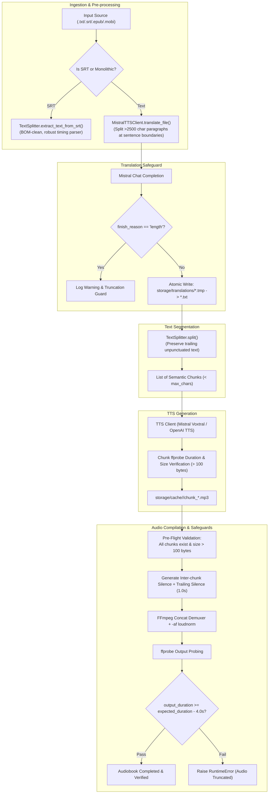
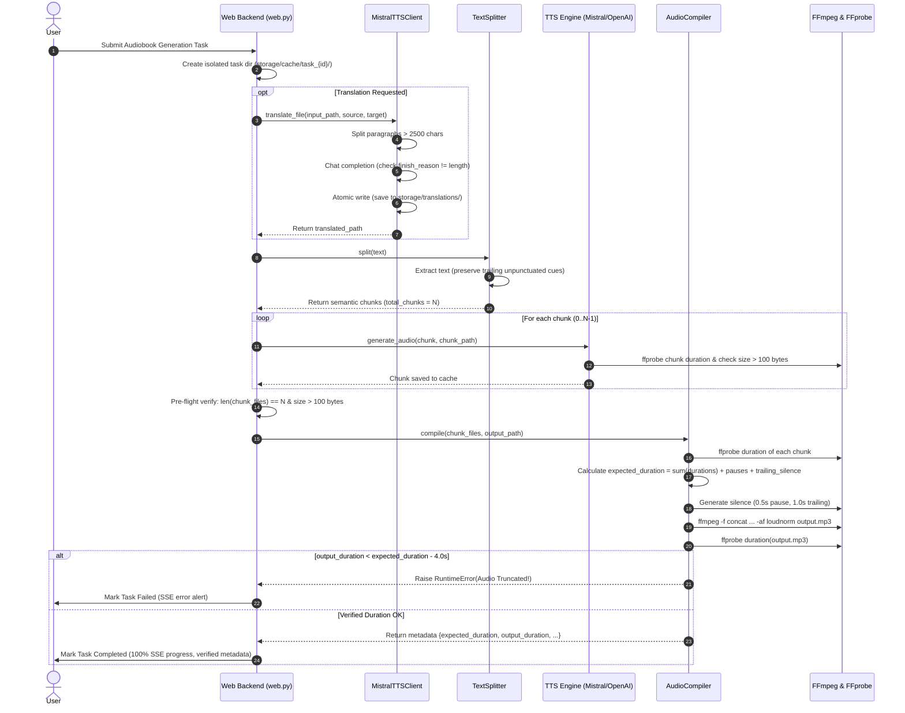

# ADR: Audio Truncation Safeguard & Duration Verification Subsystem

## Status
Accepted

---

## 1. Context & Problem Statement (Kontekst i problem)

In long-form audiobook generation pipelines, end-to-end audio integrity is paramount. Users reported intermittent issues where the final 30 seconds to over 1 minute of synthesized audiobooks were truncated, cut off mid-sentence, or omitted entirely.

A thorough technical root-cause investigation revealed multiple compounding factors across different stages of the ingestion, translation, splitting, and compilation pipeline:

### 1.1 Root Cause Analysis

1. **FFmpeg `loudnorm` Filter Lookahead Buffer Flush at Stream EOF:**
   - The final audio mastering step passes concatenated chunk MP3 streams through FFmpeg's EBU R128 loudness normalization filter (`-af loudnorm`).
   - `loudnorm` operates with an internal lookahead buffer (~1.5s to 3s). When the input stream abruptly terminates without trailing silence or proper end padding, FFmpeg flushes or drops trailing audio packets, slicing off the narrator's closing sentences.

2. **Translation API Token Exhaustion on Long Paragraphs:**
   - Source texts or ebook chapters often contain massive monolithic paragraphs exceeding 3,000–5,000 characters.
   - When submitted to Mistral chat completion endpoints (`ministral-8b-latest`, `mistral-large-latest`, etc.), the model generated responses that hit `max_tokens` limits. Mistral returned `finish_reason: "length"`, truncating the translation mid-paragraph without throwing an exception.
   - The truncated translated text was then forwarded to TTS, dropping entire story endings.

3. **SRT Parsing & Trailing Cue Edge Cases:**
   - In subtitle extraction (`.srt`), malformed blocks, variable newline delimiters (`\r\n` vs `\n`), BOM markers (`\ufeff`), or cue blocks lacking standard timing markers caused the parser to discard the trailing subtitle entries.

4. **Text Splitter Trailing Unpunctuated Text Drop:**
   - Text segmentation split sentences using punctuation lookaheads (`(?<=[.!?])\s+`). When texts lacked trailing terminal punctuation on the final sentence, incomplete chunk accumulation logic could discard or omit the final segment.

5. **Lack of Duration Probing & Silent Compilation Failures:**
   - `AudioCompiler` stitched audio chunks via FFmpeg concat demuxer but did not verify whether the final output file length matched the sum of individual synthesized audio chunks.
   - When FFmpeg aborted early or dropped chunks, the system reported task completion (HTTP 200 / "Completed") with a truncated audio file.

6. **Shared Task Temp Collisions & Non-Atomic Translation Writes:**
   - Simultaneous tasks uploading files with generic names (`input.txt`) risked filename collisions.
   - Translated files written directly to target paths risked partial reads if downstream processing began before disk flushing finished.

---

## 2. Decision & Architecture (Decyzja architektoniczna)

We implement a multi-layered **Audio Truncation Safeguard & Duration Verification** subsystem across four core modules: `AudioCompiler`, `MistralTTSClient`, `TextSplitter`, and the orchestration layer (`web.py` / `cli.py`).



---

## 3. Detailed Component Safeguards

### 3.1 `AudioCompiler` ([audio_compiler.py](file:///home/fox/repos/mistral-tts/src/core/audio_compiler.py))

1. **Trailing Silence End Padding (`trailing_silence_s`):**
   - Configurable constructor parameter with default `trailing_silence_s = 1.0` (second).
   - Dynamically probes the sample rate and audio channel layout of the first chunk (e.g., 22050 Hz mono) using `ffprobe`.
   - Generates an exact matching `trailing_silence.mp3` file via `lavfi` (`anullsrc`) and appends it to the FFmpeg concat demuxer manifest.
   - **Effect:** Provides an acoustic safety cushion for the EBU R128 `loudnorm` lookahead window, guaranteeing 100% of spoken content finishes before the stream closes.

2. **Pre-Flight Chunk Validation:**
   - Before launching FFmpeg, verifies every chunk file exists on disk and has `st_size > 100` bytes.
   - Throws immediate descriptive `FileNotFoundError` or `RuntimeError` if any chunk is missing or empty.

3. **Probe-Based Expected Duration Calculation:**
   - Executes `ffprobe` on every single chunk to determine exact length:
     $$\text{expected\_duration} = \sum_{i=1}^{N} \text{duration}(\text{chunk}_i) + (N - 1) \times \text{pause\_duration\_s} + \text{trailing\_silence\_s}$$
   
4. **Strict Duration Verification & Tolerance Check:**
   - Probes final compiled output file duration using `ffprobe`.
   - Tolerance threshold set to `4.0s` to account for MP3 frame padding, container header overhead, and minor encoder drift.
   - If `output_duration < (expected_duration - 4.0)`, compilation fails immediately by raising:
     ```python
     raise RuntimeError(
         f"Audiobook compilation truncated output: expected at least {expected_duration - tolerance:.2f}s "
         f"(expected ~{expected_duration:.2f}s across {len(chunk_paths)} chunks), "
         f"but final file is only {output_duration:.2f}s. "
         f"Audio was truncated by {expected_duration - output_duration:.2f}s!"
     )
     ```
   - Returns structured metadata dictionary:
     `{"expected_duration": float, "output_duration": float, "total_chunks": int, "total_chunks_duration": float, "output_path": Path}`.

---

### 3.2 `MistralTTSClient` ([mistral_client.py](file:///home/fox/repos/mistral-tts/src/api/mistral_client.py))

1. **Sentence-Aware Paragraph Segmentation for Translation:**
   - Plain text translation splits incoming text on double newlines (`\n\n`).
   - Any paragraph exceeding 2,500 characters is segmented at sentence boundaries (`re.split(r'(?<=[.!?])\s+', p)`).
   - If an individual sentence exceeds 2,500 characters, it falls back to word-boundary chunking.
   - Chunks are assembled within a 2,500-character ceiling to comfortably fit within model context windows and output token bounds.

2. **`finish_reason == "length"` Detection:**
   - In both [`translate_text()`](file:///home/fox/repos/mistral-tts/src/api/mistral_client.py#L186-L227) and batch SRT JSON translation, inspects `choice.finish_reason`.
   - Logs an explicit `WARNING` when the response hits the token limit, alerting operators to potential text truncation.

3. **Atomic File Replacement:**
   - Writes translated content to a temporary sibling file (`{output_path}.tmp`).
   - Executes atomic filesystem replacement via `temp_output_path.replace(output_path)` inside a try/finally block ensuring temporary file cleanup.
   - Guarantees zero partial/corrupted files in `storage/translations/`.

4. **Input Stem Preservation:**
   - Preserves source file stem when naming translated files:
     `{input_path.stem}_translated_{target_lang.lower().replace(' ', '_')}{output_suffix}`.
   - E.g., `wtfs_s02e02.srt` becomes `wtfs_s02e02_translated_english.srt`.

---

### 3.3 `TextSplitter` ([text_splitter.py](file:///home/fox/repos/mistral-tts/src/core/text_splitter.py))

1. **Robust SRT Ingestion:**
   - Strips UTF-8 BOM (`\ufeff`) and normalizes line endings (`\r\n` $\to$ `\n`).
   - Identifies timing lines containing `-->`, extracting all subsequent subtitle text cues per block regardless of cue formatting or line breaks.
   - Handles fallback blocks lacking `-->` by retaining non-numeric content lines.

2. **Preservation of Trailing Unpunctuated Text:**
   - Normalizes whitespace across the corpus while preserving raw wording.
   - Appends any accumulated `current_chunk` buffer upon reaching EOF, ensuring trailing sentences lacking periods, question marks, or exclamation points are never dropped.

---

### 3.4 Orchestration Layer ([web.py](file:///home/fox/repos/mistral-tts/src/web.py) & [cli.py](file:///home/fox/repos/mistral-tts/src/cli.py))

1. **Isolated Task Directories:**
   - Web task uploads are isolated into dedicated per-task subdirectories (`storage/cache/task_{task_id}/`).
   - Filenames are sanitized while preserving original base stems (`safe_stem`).
2. **Pre-Compilation Audio Verification:**
   - Validates that `len(chunk_files) == total_chunks` and every file exists with size $> 100$ bytes before calling `AudioCompiler.compile()`.
3. **Structured Verification Logging:**
   - Logs verified compilation duration against expected chunk duration, giving operators immediate visibility in both CLI progress bars and WebUI SSE console output.

---

## 4. Sequence Diagram: Protected Audio Generation Pipeline



---

## 5. Verification & Test Coverage (Weryfikacja i testy)

The entire safeguard subsystem is covered by automated unit and integration tests across the test suite:

| Test File | Test Case | Safeguard Verified |
| --- | --- | --- |
| `tests/test_audio_compiler.py` | `test_compile_trailing_silence_parameter` | Verifies `trailing_silence_s` defaults to 1.0s and injects end padding. |
| `tests/test_audio_compiler.py` | `test_compile_duration_verification_success` | Probes chunks and asserts output duration matches within 4.0s tolerance. |
| `tests/test_audio_compiler.py` | `test_compile_duration_verification_failure` | Simulates truncated output and verifies `RuntimeError` is raised. |
| `tests/test_audio_compiler.py` | `test_compile_empty_or_missing_chunk_raises` | Verifies pre-flight file existence and non-zero byte checks. |
| `tests/test_text_splitter.py` | `test_split_trailing_unpunctuated_text` | Confirms trailing sentences lacking terminal punctuation are not dropped. |
| `tests/test_text_splitter.py` | `test_extract_text_from_srt_edge_cases` | Validates multi-line cues, BOM headers, and malformed SRT timing lines. |
| `tests/test_translation.py` | `test_translate_file_paragraph_chunking` | Verifies paragraphs $> 2500$ chars are split at sentence boundaries. |
| `tests/test_translation.py` | `test_translate_file_atomic_replacement` | Validates atomic `.tmp` to final path replacement and cleanup. |
| `tests/test_translation.py` | `test_translate_text_length_truncation_warning` | Verifies warning log on `finish_reason == "length"`. |
| `tests/test_web.py` & `tests/test_tui.py` | Integration test suite | Verifies end-to-end task isolation and metadata logging. |

All 118 automated tests in `tests/` pass with zero regressions.

---

## 6. Bilingual Changelog / Notatki o Wdrożeniu

### English
- **AudioCompiler:** Added `trailing_silence_s` parameter (default: 1.0s). Generates format-matched trailing silence padding to prevent FFmpeg `loudnorm` lookahead truncation. Added probe-based `expected_duration` calculation and output duration verification raising `RuntimeError` on truncation.
- **MistralTTSClient:** Split paragraphs $> 2500$ chars at sentence/word boundaries in `translate_file()`. Added detection and logging for `finish_reason == "length"`. Implemented atomic file write/replace for translations and input stem preservation.
- **TextSplitter:** Enhanced SRT extraction to robustly parse subtitle blocks without dropping trailing cues. Guaranteed retention of trailing unpunctuated sentences.
- **Web / CLI:** Isolated uploaded task files into dedicated subdirectories. Added pre-compilation validation ensuring 100% of chunks exist and exceed 100 bytes.

### Polski
- **AudioCompiler:** Dodano parametr `trailing_silence_s` (domyślnie: 1.0s). Generuje dopasowaną ciszę końcową, eliminując obcinanie końcówki audio przez filtr `loudnorm` w FFmpeg. Wdrożono weryfikację czasu trwania przez `ffprobe` z tolerancją 4.0s, rzucającą wyjątek `RuntimeError` w razie utraty audio.
- **MistralTTSClient:** Dzielenie akapitów powyżej 2500 znaków na granicy zdań w `translate_file()`. Obsługa i ostrzeżenia przy `finish_reason == "length"`. Wprowadzono atomowy zapis plików tłumaczeń (`.tmp` $\to$ plik docelowy) oraz zachowanie nazwy bazowej pliku źródłowego.
- **TextSplitter:** Usprawniono parsowanie napisów SRT z obsługą BOM i nietypowych znaczników. Zagwarantowano zachowanie tekstu końcowego bez znaków interpunkcyjnych.
- **Web / CLI:** Izolacja zadań w odrębnych katalogach tymczasowych. Weryfikacja wstępna obecności wszystkich wygenerowanych fragmentów audio przed kompilacją.
