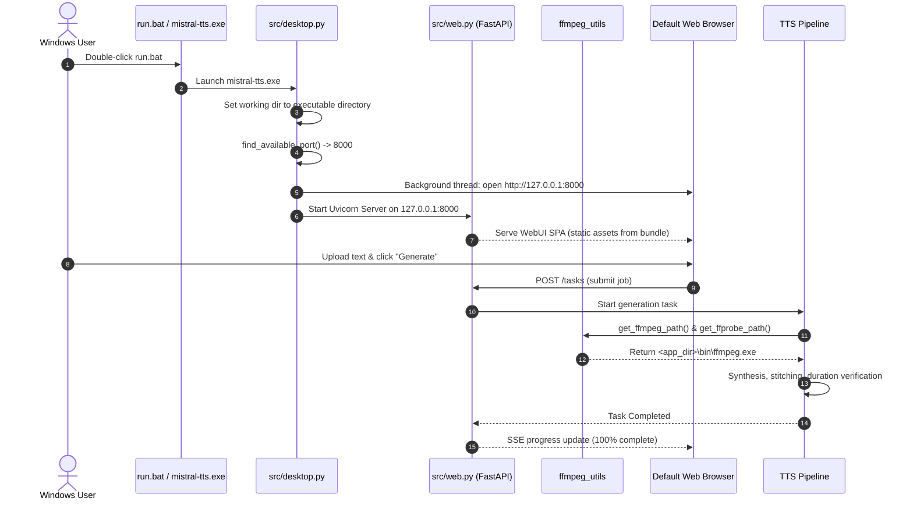

# ADR: Standalone Windows Portable Executable & Automated CI Pipeline
(Samodzielny Pakiet Wykonywalny dla Systemu Windows i Zautomatyzowany Potok CI)

## Status
Accepted

---

## 1. Context & Problem Statement (Kontekst i problem)

Mistral-TTS-Booksmith provides an automated pipeline for converting books and long-form texts into audiobooks using Mistral Voxtral and OpenAI TTS. Historically, running the application required:
1. Installing Python 3.11+ and setting up virtual environments.
2. Installing FFmpeg and ffprobe separately and correctly configuring system `PATH` variables.
3. Cloning the repository and launching via CLI or Uvicorn.

For non-technical users on Windows (writers, audiobook listeners, content creators), these prerequisites formed a significant barrier to adoption. Misconfigured `PATH` variables, missing FFmpeg binaries, Python version mismatches, and execution policy restrictions frequently led to support requests and failed runs.

### Core Objectives:
- Deliver a **zero-setup, portable distribution** for 64-bit Windows (`mistral-tts-windows-x64.zip`).
- Eliminate all local dependencies: embed Python runtime, pre-compiled static web assets, and standalone `ffmpeg.exe` and `ffprobe.exe` binaries directly into the distribution package.
- Provide a double-click launcher (`mistral-tts.exe` or `run.bat`) that automatically handles port conflicts and launches the WebUI in the user's default web browser.
- Establish an automated, resilient CI pipeline in Gitea Actions to build, package, and publish desktop releases on every tag and main push.

---

## 2. Decision & Architecture (Decyzja architektoniczna)

We implement a four-pillar desktop packaging and binary resolution architecture:

1. **Multi-Tier Dynamic Binary Resolution (`src/core/ffmpeg_utils.py`):**
   Decouples the codebase from system-level `PATH` dependencies by implementing a hierarchical search strategy across PyInstaller extraction directories (`_MEIPASS`), portable bundle folders (`sys.executable`), development trees, and system `PATH`.
2. **Desktop Launcher Orchestration (`src/desktop.py` & root `desktop.py`):**
   Provides an entrypoint that dynamically discovers an open port (starting at 8000), runs the FastAPI backend via Uvicorn, and triggers background opening of the user's default browser tab.
3. **PyInstaller Multi-Asset Bundling Specification (`mistral-tts.spec`):**
   Configures `onedir` packaging bundling static HTML/CSS/JS assets, core Python modules, external dependency submodules, and optional bundled binaries.
4. **Gitea Actions Automated Build Pipeline (`.gitea/workflows/build-windows.yml`):**
   Automates building Windows executables on standard Linux runners (`runs-on: ubuntu-latest`) by directly installing Wine and Windows Python 3.11 (without requiring nested Docker daemon sockets), downloading pre-built FFmpeg binaries (with dual-source Gyan.dev/BtbN fallback), running PyInstaller compilation via Wine, bundling helper scripts (`run.bat`), and publishing `mistral-tts-windows-x64.zip` build artifacts.

```mermaid
flowchart TD
    subgraph CI Build Stage [Gitea Actions Linux Host Runner]
        Checkout["Check out source code (public endpoint)"] --> DownloadFFmpeg["Download Windows FFmpeg / FFprobe Binaries<br>(Gyan.dev with BtbN fallback)"]
        DownloadFFmpeg --> InstallWine["Install Wine & Windows Python 3.11"]
        InstallWine --> WinePip["wine python -m pip install -r requirements.txt"]
        WinePip --> PyInstaller["wine python -m PyInstaller mistral-tts.spec"]
        PyInstaller --> PackageZip["Package dist/mistral-tts + bin/ + run.bat<br>-> mistral-tts-windows-x64.zip"]
        PackageZip --> UploadArtifact["Upload Artifact (actions/upload-artifact)"]
    end

    subgraph Runtime Launch [User Windows Machine]
        User["User launches run.bat / mistral-tts.exe"] --> DesktopMain["src/desktop.py: main()"]
        DesktopMain --> DetectPort["Port Negotiation: find_available_port(8000..8020)"]
        DetectPort --> SpawnUvicorn["Start Uvicorn Server (FastAPI)"]
        DetectPort --> OpenBrowser["Background Thread: webbrowser.open(http://127.0.0.1:port)"]
    end

    subgraph Audio Processing [FFmpeg Resolution]
        AudioComp["AudioCompiler / MistralTTSClient"] --> ResBin["ffmpeg_utils.resolve_binary()"]
        ResBin --> CheckMEIPASS{"Inside sys._MEIPASS?"}
        CheckMEIPASS -->|Yes| UseBundledMEI["Use _MEIPASS/bin/ffmpeg.exe"]
        CheckMEIPASS -->|No| CheckExe{"Inside sys.executable dir?"}
        CheckExe -->|Yes| UsePortable["Use exe_dir/bin/ffmpeg.exe"]
        CheckExe -->|No| CheckPath{"Found in system PATH?"}
        CheckPath -->|Yes| UseSystem["Use system PATH binary"]
        CheckPath -->|No| FallbackCmd["Fallback to command string"]
    end
```



---

## 3. Detailed Component Architecture

### 3.1 Binary Path Resolution Hierarchy ([ffmpeg_utils.py](file:///home/fox/repos/mistral-tts/src/core/ffmpeg_utils.py))

External tools such as `ffmpeg` and `ffprobe` are invoked throughout the audio pipeline (`afftdn` voice sample denoising, `AudioCompiler` concat stitching, and decoded presentation duration verification).

The helper function `resolve_binary(binary_name: str) -> str` resolves binary paths via a 4-tier precedence search:

```
[Tier 1: PyInstaller onefile directory (sys._MEIPASS/bin, sys._MEIPASS/tools, sys._MEIPASS)]
                                    │ (if not found)
                                    ▼
[Tier 2: Portable onedir directory (sys.executable parent/bin, tools, or root)]
                                    │ (if not found)
                                    ▼
[Tier 3: Development project root (project_root/bin, project_root/tools)]
                                    │ (if not found)
                                    ▼
[Tier 4: System PATH fallback via shutil.which()]
```

**Key Features:**
- **Platform-Aware Extension Priority:** On Windows (`os.name == "nt"` or `sys.platform.startswith("win")`), `.exe` is prioritized before extensionless checks.
- **Directory Collision Protection:** Candidates that resolve to directories matching the binary name are discarded to prevent invocation errors.
- **Unified Wrappers:** `get_ffmpeg_path()` and `get_ffprobe_path()` expose resolved strings directly to `subprocess.run()` calls in [`AudioCompiler`](file:///home/fox/repos/mistral-tts/src/core/audio_compiler.py) and [`MistralTTSClient`](file:///home/fox/repos/mistral-tts/src/api/mistral_client.py).

---

### 3.2 Desktop Launcher ([src/desktop.py](file:///home/fox/repos/mistral-tts/src/desktop.py) & [desktop.py](file:///home/fox/repos/mistral-tts/desktop.py))

`src/desktop.py` is the application entrypoint for the desktop bundle:

1. **Working Directory Standardization:**
   When running under PyInstaller (`getattr(sys, "frozen", False)`), `os.chdir()` aligns the working directory to `Path(sys.executable).resolve().parent`. This ensures that relative directories (`storage/cache/`, `storage/output/`, `.env`) resolve directly next to the portable executable.
2. **Dynamic Port Discovery:**
   `find_available_port(start_port=8000, max_attempts=20)` binds temporary TCP sockets across a range of ports to detect an open port, preventing crashes if port 8000 is occupied by another local service.
3. **Background Browser Opener:**
   `open_browser(url, delay=1.2)` spawns a daemon thread waiting 1.2 seconds for Uvicorn initialization before launching `webbrowser.open(url)`.
4. **Command-Line Overrides:**
   Supports `--host`, `--port`, and `--no-browser` flags for advanced or headless execution.

---

### 3.3 PyInstaller Specification ([mistral-tts.spec](file:///home/fox/repos/mistral-tts/mistral-tts.spec))

The PyInstaller spec is configured for **`onedir`** distribution:
- **Data Bundles:** Static assets (`src/web/static`) are mapped directly to `src/web/static`.
- **Static Assets Resolution in FastAPI:** [`src/web.py`](file:///home/fox/repos/mistral-tts/src/web.py) includes `get_static_dir()` which checks `sys._MEIPASS` when running in bundled mode, falling back to repository root in development mode.
- **Explicit Hidden Imports:** Collects dynamic submodules from `uvicorn`, `fastapi`, `starlette`, `pydantic`, `mistralai`, `openai`, `textual`, `anyio`, `multipart`, and `dotenv`.
- **Executable Configuration:** Produces `mistral-tts.exe` with console enabled (`console=True`) so users can inspect real-time server output, or launch silently in the background.

---

### 3.4 Automated Gitea Actions CI Workflow ([.gitea/workflows/build-windows.yml](file:///home/fox/repos/mistral-tts/.gitea/workflows/build-windows.yml))

Executes on standard Linux runners (`runs-on: ubuntu-latest`) using native Wine and Windows Python 3.11, eliminating the need for dedicated Windows runner hosts and removing dependencies on nested `/var/run/docker.sock` daemon sockets:
1. **Host-Level Actions & Robust Public Domain Checkout:**
   Checks out the source code directly via `https://gitea.marcin-lis.pl/fox/mistral-tts.git` with branch and fallback handling, preventing hostname resolution errors (`gitea:3000`) within isolated runner networks.
2. **FFmpeg Acquisition with Dual-Source Fallback:**
   Downloads Windows 64-bit FFmpeg essentials archive from `https://www.gyan.dev/ffmpeg/builds/ffmpeg-release-essentials.zip`. If Gyan.dev is temporarily unreachable or rate-limited, it automatically falls back to GitHub releases (`BtbN/FFmpeg-Builds`).
3. **Binary Extraction:**
   Extracts `ffmpeg.exe` and `ffprobe.exe` into a local `bin/` directory.
4. **Native Wine & Windows Python 3.11 Setup:**
   Installs `wine`, `wine64`, and provisions the official portable Windows Python 3.11 embeddable runtime with `get-pip.py` in a 64-bit Wine prefix (`WINEARCH=win64`), avoiding GUI/MSI installer crashes.
5. **Dependency Installation & PyInstaller Build:**
   Installs Python dependencies with `wine python -m pip install -r requirements.txt` and `wine python -m pip install pyinstaller`, then compiles via `wine python -m PyInstaller mistral-tts.spec` into `dist/mistral-tts/`.
6. **Bundle Assembly & Script Generation:**
   Copies `bin/` into `dist/mistral-tts/bin/`. Creates a convenient batch script `dist/mistral-tts/run.bat`:
   ```bat
   @echo off
   cd /d "%~dp0"
   echo Starting Mistral-TTS-Booksmith...
   mistral-tts.exe
   pause
   ```
7. **Artifact Publishing:**
   Compresses `dist/mistral-tts` into `mistral-tts-windows-x64.zip` and uploads it via `actions/upload-artifact@v4`.

---

## 4. Sequence Diagram: Portable Desktop Lifecycle



---

## 5. Verification & Test Coverage (Weryfikacja i testy)

The binary resolution and desktop launcher mechanisms are verified by automated tests in [`tests/test_ffmpeg_utils.py`](file:///home/fox/repos/mistral-tts/tests/test_ffmpeg_utils.py):

| Test Case | Scenario Verified |
| --- | --- |
| `test_resolve_binary_fallback` | Binary not found anywhere falls back to standard binary name string. |
| `test_resolve_binary_from_system_path` | System `PATH` resolution returns command name when available via `shutil.which`. |
| `test_resolve_binary_from_meipass` | Bundled binary inside `sys._MEIPASS/bin` takes top precedence. |
| `test_resolve_binary_from_meipass_exe` | Windows `.exe` extension inside `sys._MEIPASS` resolved correctly. |
| `test_resolve_binary_next_to_frozen_executable` | Portable onedir mode resolves binaries in `sys.executable` parent `bin/` directory. |
| `test_get_ffmpeg_and_ffprobe_helpers` | Helper functions correctly invoke dynamic binary resolution. |
| `test_web_get_static_dir_meipass` | FastAPI static file provider respects PyInstaller `_MEIPASS` path. |
| `test_web_get_static_dir_dev` | FastAPI static file provider returns local development path when unfrozen. |
| `test_web_get_static_dir_fallback` | Graceful fallback when static path is not found. |
| `test_desktop_find_available_port` | Dynamic port negotiation binds and returns an open port. |
| `test_desktop_open_browser` | Background thread initiates browser launch without blocking server startup. |
| `test_resolve_binary_from_meipass_root` | Resolves binary placed in `_MEIPASS` root without subfolder. |
| `test_resolve_binary_windows_platform_precedence` | Prioritizes `.exe` extension over extensionless candidate on Windows. |
| `test_resolve_binary_directory_collision_ignored` | Directory with same name as binary is ignored during file search. |
| `test_audio_compiler_invokes_resolved_binaries` | Verifies `AudioCompiler` executes dynamically resolved FFmpeg and FFprobe paths. |

All automated tests in `tests/test_ffmpeg_utils.py` and the complete test suite pass with zero errors.

---

## 6. Bilingual Changelog / Notatki o Wdrożeniu

### English
- **Standalone Windows Executable:** Added zero-setup desktop distribution for Windows x64 (`mistral-tts-windows-x64.zip`) bundling PyInstaller binary, web assets, and pre-compiled FFmpeg/FFprobe binaries.
- **Dynamic Binary Resolution:** Implemented [`src/core/ffmpeg_utils.py`](file:///home/fox/repos/mistral-tts/src/core/ffmpeg_utils.py) with a 4-tier resolution hierarchy (`_MEIPASS`, `sys.executable`, repository root, system `PATH`) with `.exe` precedence on Windows and directory collision protection. Integrated into `AudioCompiler` and `MistralTTSClient`.
- **Desktop Launcher:** Created [`src/desktop.py`](file:///home/fox/repos/mistral-tts/src/desktop.py) and [`desktop.py`](file:///home/fox/repos/mistral-tts/desktop.py) with collision-free port negotiation (from 8000), background browser opening, working directory anchoring, and CLI argument support.
- **Packaging & CI Pipeline:** Added [`mistral-tts.spec`](file:///home/fox/repos/mistral-tts/mistral-tts.spec) for `onedir` packaging and [`.gitea/workflows/build-windows.yml`](file:///home/fox/repos/mistral-tts/.gitea/workflows/build-windows.yml) for automated Gitea Actions builds on Linux runners using native Wine and Windows Python 3.11, with dual-source FFmpeg acquisition, `run.bat` generation, and zip artifact publishing.

### Polski
- **Samodzielny Pakiet Wykonywalny dla Windows:** Wprowadzono przenośną dystrybucję desktopową dla systemu Windows x64 (`mistral-tts-windows-x64.zip`), integrującą plik wykonywalny PyInstaller, zasoby webowe oraz skompilowane binarki FFmpeg i FFprobe bez konieczności instalowania Pythona czy konfiguracji zmiennych środowiskowych.
- **Dynamiczne Rozpoznawanie Binariów:** Wdrożono moduł [`src/core/ffmpeg_utils.py`](file:///home/fox/repos/mistral-tts/src/core/ffmpeg_utils.py) z 4-poziomową hierarchią wyszukiwania (`_MEIPASS`, katalog `sys.executable`, katalog projektu, systemowy `PATH`), priorytetem rozszerzenia `.exe` na Windows i ochroną przed kolizjami katalogów. Zintegrowano z `AudioCompiler` i `MistralTTSClient`.
- **Launcher Desktopowy:** Utworzono moduł [`src/desktop.py`](file:///home/fox/repos/mistral-tts/src/desktop.py) oraz plik startowy [`desktop.py`](file:///home/fox/repos/mistral-tts/desktop.py) z automatycznym wykrywaniem wolnego portu (od 8000), automatycznym otwieraniem domyślnej przeglądarki, kotwiczeniem katalogu roboczego oraz obsługą parametrów wiersza poleceń.
- **Pakowanie i Potok CI:** Dodano specyfikację [`mistral-tts.spec`](file:///home/fox/repos/mistral-tts/mistral-tts.spec) dla pakowania `onedir` oraz potok CI w Gitea Actions [`.gitea/workflows/build-windows.yml`](file:///home/fox/repos/mistral-tts/.gitea/workflows/build-windows.yml) uruchamiany na runnerach linuksowych z natywnym Wine i Windows Python 3.11, pobierający FFmpeg (Gyan.dev z zapasowym źródłem BtbN), generujący skrypt pomocniczy `run.bat` i publikujący archiwum ZIP jako artefakt.
